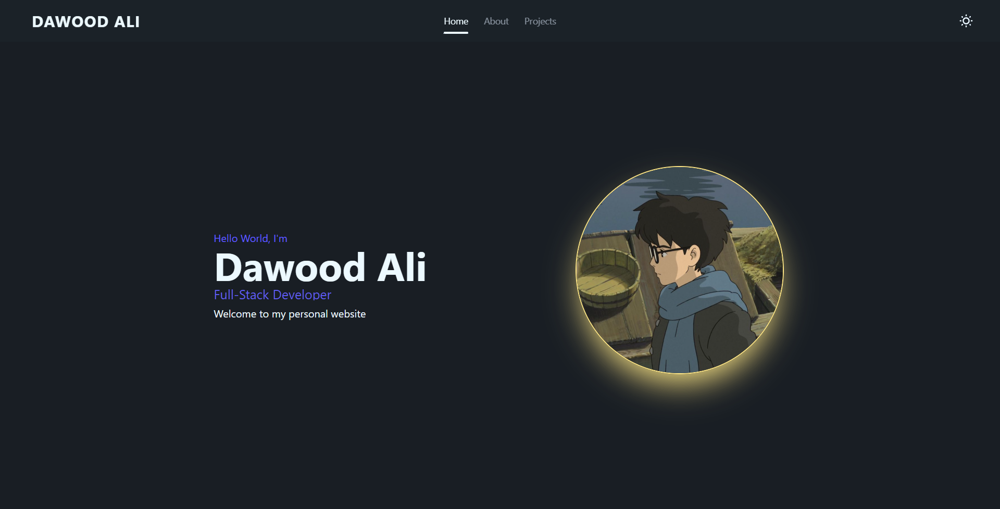

  

# Personal Portfolio Website

A modern, responsive personal portfolio built with React, Tailwind CSS v4, and DaisyUI. This project showcases my personal projects, background, and technical skills as a Full-Stack Developer.

---

## Demo & Preview

* Live Site: https://nfrx1.github.io/Portfolio/

---

## Built With

* React (Vite)
* Tailwind CSS v4
* DaisyUI
* GitHub Pages

---

## Features

* Fully Responsive Layout: Seamless experience across mobile, tablet, and desktop devices.
* Theme Controller: Toggle between Light/Dark themes using DaisyUI theme controllers.
* Dynamic Tab Navigation: Smooth client-side view switching (Home, About, Projects).
* Interactive Skills Showcase: Grid view of technical skills with custom level tooltips and hover effects.
* Featured Projects Grid: Categorized portfolio items with live demo links and GitHub repository shortcuts.

---

## Project Structure

src/
├── assets/             # Static images, icons, and skill logos
├── Components/
│   ├── About/          # About page component & Skill card component
│   ├── Main/           # Home section, bio text, and hero image
│   ├── NavBar/         # Navigation header and theme switcher
│   └── Projects/       # Projects list and showcase cards
├── App.jsx             # Main layout & state management for active tabs
├── index.css           # Global CSS, Tailwind CSS imports & DaisyUI plugin
└── main.jsx            # React root entry point

---

## Getting Started

Follow these steps to run the project locally on your machine:

### Prerequisites

Make sure you have Node.js installed:
* Node.js (v18.0 or higher recommended)

### Installation

1. Clone the repository:
   git clone https://github.com/nfrx1/Portfolio.git
   cd Portfolio

2. Install dependencies:
   npm install

3. Start the development server:
   npm run dev

4. Open http://localhost:5173 in your browser to view the app.

---

## Author

Dawood Ali
* GitHub: https://github.com/nfrx1
